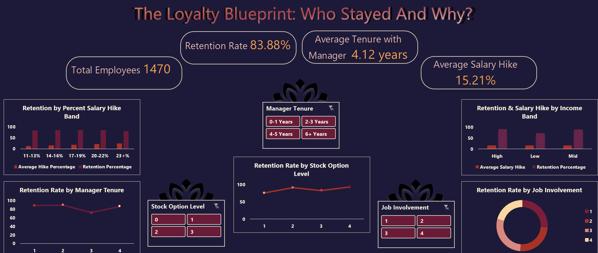

# The Loyalty Blueprint: Who Stayed and Why?

This project is the second installment in a two-part HR analytics series. While Part 1- *The Exit Equation* explored what causes employee attrition, this second phase investigates what drives retention. By combining SQL-powered analysis with an Excel dashboard, this project uncovers the behavioral and compensation-linked factors behind employee loyalty.

## TL;DR
 * Goal: Identify what drives employee retention and uncover the patterns behind long-term loyalty
 * Tools: MySQL (Data Cleaning & Segmentation), Microsoft Excel (Dashboard)
 * Approach: Segmented employees by salary hike, manager tenure, stock options, and job involvement
 * Outcome: Found key loyalty levers in experienced leadership, moderate incentives, and engaged mindsets.

## Table of Contents
 * [Overview](#overview)
 * [Key Questions Answered](#key-questions-answered)
 * [Dashboard Preview Section](#dashboard-preview-section)
 * [KPIs Tracked](#kpis-tracked)
 * [Business Insights & Strategic Recommendations](#business-insights--strategic-recommendations)
 * [Tools Used](#tools-used)
 * [Folder Structure](#folder-structure)
 * [Case Study: Behind the Queries](#case-study-behind-the-questies)
 * [What I'd Explore Next](#what-id-explore-next)
 * [What This Project Demonstrates](#what-this-project-demonstrates)
 * [Let's Connect](#lets-connect)

## Overview
Using a synthetic HR dataset of 1470 employees, this analysis pinpoints the key contributors to employee retention. SQL was used to calculate loyalty metrics across compensation bands and engagement indicators. These were then visualized in Excel to help HR leaders double down on what's working.

## Key Questions Answered
 * Which salary hikes are most linked to retention?
 * Does income level affect employee loyalty?
 * How does manager tenure impact long-term retention?
 * Do stock options or job involvement improve loyalty outcomes?
 * What strategic levers can HR teams pull to retain top talent?

## Dashboard Preview Section
The dashboard below visualizes retention metrics such as salary hike bands, income levels, stock options, and engagement levels. It was built using Excel and is designed to guide strategic talent investment.

## KPIs Tracked
 * Total Employees 1470
 * Overall Retention Rate: 83.88%
 * Average Manager Tenure: 4.12 years
 * Average Salary Hike: 15.21%

## Business Insights & Strategic Recommendations

### Salary Hike & Retention
 * **Insight**: Retention peaked at 17-19% hikes but dropped when hikes exceeded 23%.
 * **Recommendation**: Align raise percentages with employee satisfaction levels; overcompensating without engagement won't buy loyalty.

### Income Band & Loyalty
 * **Insight**: High-income employees had a 89.2% retention rate, vs. 71.39% for low-income.
 * **Recommendation**: Focus on total rewards and progression for lower bands to prevent quiet quitting or churn.
 
### Manager Tenure
 * **Insight**: Employees with managers of 6+ years had 89.95% retention, the highest in the dataset.
 * **Recommendation**: Retain experienced managers and implement mentorship programs for new team leads. 

### Stock Option Level
 * **Insight**: Stock Option Level 2 had the best loyalty outcomes at 92.41%.
 * **Recommendation**: Moderate, achievable incentives drive better engagement than none or over-the-top perks. 

### Job Involvement
 * **Insight**: Level 4 involvement had 90.97% retention, the lowest attrition across the board.
 * **Recommendation**: Build a culture of autonomy, recognition, and trust to foster long-term engagement.

## Tools Used
 - *SQL*: For retention metrics, data segmentation, and calculations
 - *Excel*: For dashboard creation, KPI visualization, and pattern detection

## Folder Structure 
|Folder                   | Description                       |
|-------------------------|-----------------------------------|
|`README.md`              | Project documentation and summary |
|`retention_rate.xlsx`    | Interactive dashboard             |
|`/images/`               | Dashboard Preview Screenshot      |
|`/sql_queries/`          | All queries used for analysis     |

## Case Study: Behind the Queries
For a full walkthrough of methodology, SQL logic, and insight development, read the detailed case study:

[View full case study](https://docs.google.com/document/d/1lmSIyW4AsWBMPn9TkkJxtW42j8BunomERdXkg3M_VFQ/edit?usp=sharing)

## What I'd Explore Next
If this were a real consulting engagement: 
 * Map retention trends across promotion cycles
 * Compare loyalty across hybrid vs remote, vs on-site roles
 * Cluster employees by loyalty signals to build HR personas

## What This Project Demonstrates
 * End-to-end thinking from raw data to business-aligned insight
 * Comfort using both SQL and Excel to create scalable, functional dashboards
 * Understanding of HR levers that go beyond surface metrics
 * Strategic recommendations grounded in stakeholder impact

## Let's Connect
I'm actively building tools to uncover workplace insights through data. Feel free to reach out via:
 - [GitHub](https://github.com/Shrey0561)
 - [LinkedIn](https://www.linkedin.com/in/shreya-srinath-879a66205/)
 - [Notion](https://www.notion.so/Data-Analyst-Portfolio-221ebe151fdd801e9445e32590b67758?source=copy_link)

I'm always up for conversations or new opportunities!
